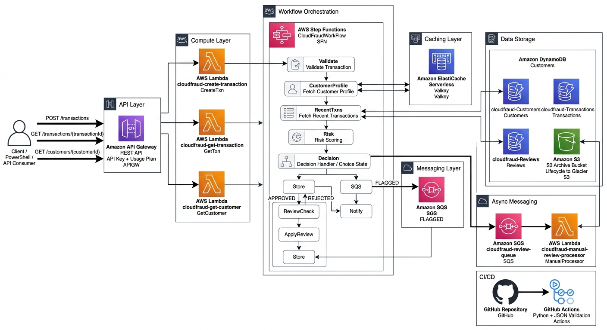

# CloudFraud

CloudFraud is a cloud-first serverless fraud detection platform built on AWS using an event-driven microservices architecture. The system processes financial transactions, performs risk analysis through an orchestrated workflow, and automatically approves, rejects, or flags transactions for manual review.

---

# Architecture Overview

CloudFraud is built using multiple AWS services:

- AWS Lambda
- AWS Step Functions
- Amazon API Gateway
- Amazon DynamoDB
- Amazon SQS
- Amazon ElastiCache (Valkey)
- Amazon S3
- GitHub Actions

The platform follows a scalable serverless architecture designed for resilience, asynchronous processing, and low operational overhead.

---

# Architecture Diagram



---

# Features

## Transaction Processing Workflow

Transactions flow through a multi-stage Step Functions workflow:

1. Transaction validation
2. Customer profile retrieval
3. Recent transaction analysis
4. Risk scoring
5. Automated decision handling

Transactions are automatically categorised as:

- APPROVED
- REJECTED
- FLAGGED FOR REVIEW

Flagged transactions are asynchronously processed using Amazon SQS.

---

# AWS Services Used

| Service | Purpose |
|---|---|
| API Gateway | REST API entry point |
| Lambda | Business logic execution |
| Step Functions | Workflow orchestration |
| DynamoDB | Transaction & customer storage |
| ElastiCache (Valkey) | Caching layer |
| SQS | Async review queue |
| S3 | Archival storage |
| CloudWatch | Monitoring & logging |
| GitHub Actions | CI/CD validation |

---

# REST API Endpoints

## Create Transaction

```http
POST /transactions
```

## Get Transaction

```http
GET /transactions/{transactionId}
```

## Get Customer

```http
GET /customers/{customerId}
```

---

# Workflow Design

The Step Functions workflow includes:

- Choice states for decision branching
- Retry logic for resilience
- Catch blocks for failure handling
- Wait states for delayed review processing
- Async messaging using SQS

This design improves:

- Scalability
- Observability
- Maintainability
- Fault tolerance

---

# Caching Strategy

CloudFraud uses Amazon ElastiCache (Valkey) to reduce database load and improve latency.

Cached services include:

- Customer profile lookups
- Recent transaction retrieval

This reduces repeated DynamoDB queries and improves response times under load.

---

# Security

Security considerations implemented include:

- Least-privilege IAM roles
- API Gateway API keys
- Usage plans
- Environment variables for secrets/configuration
- Private S3 archival bucket
- Controlled DynamoDB access
- Secure Lambda-to-service communication

---

# CI/CD

GitHub Actions is used to validate:

- Python Lambda code
- Step Functions JSON definitions

This provides lightweight CI validation for the serverless workflow.

---

# Load Testing & Monitoring

The platform was tested using concurrent PowerShell API requests.

Monitoring and observability included:

- API Gateway metrics
- Lambda metrics
- Step Functions execution tracking
- CloudWatch logs

Failure handling and retry behaviour were validated during stress testing.

---

# Key Engineering Concepts Demonstrated

- Event-driven architecture
- Serverless computing
- Async messaging
- Workflow orchestration
- Distributed systems
- API security
- Cloud caching
- Fault tolerance
- CI/CD validation
- Observability & monitoring

---

# Design Decisions & Trade-Offs

## Step Functions vs Single Lambda

Step Functions were chosen over a monolithic Lambda approach to improve:

- Workflow visibility
- Maintainability
- Retry handling
- Scalability

## DynamoDB vs Relational Database

DynamoDB was selected due to:

- Serverless scaling
- Low operational overhead
- Fast key-value access patterns

## Caching vs Direct Database Queries

ElastiCache reduced:

- Latency
- Database load
- Repeated transaction lookups

---

# Future Improvements

Potential future improvements include:

- Frontend dashboard
- CloudWatch alarms
- Enhanced monitoring
- Improved retry handling
- Infrastructure-as-Code deployment
- Enhanced analytics & reporting

---

# Repository Contents

This repository currently contains:

- AWS Lambda source code
- Architecture diagrams
- Workflow validation configuration

Infrastructure resources are deployed directly within AWS.

---

# Technologies

- Python
- AWS Lambda
- AWS Step Functions
- DynamoDB
- Amazon SQS
- API Gateway
- ElastiCache (Valkey)
- Amazon S3
- GitHub Actions

---


# Author

Ryan Daly

- GitHub: https://github.com/Ryan2805
- LinkedIn: https://www.linkedin.com/in/ryan-daly-62a0a9335/
